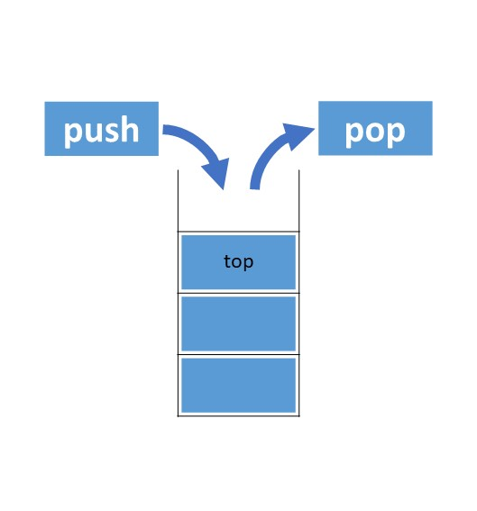
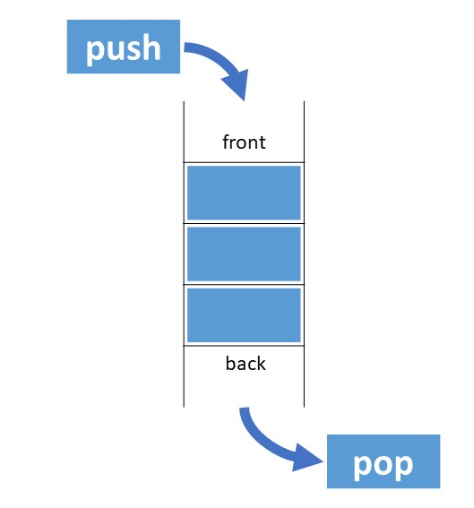
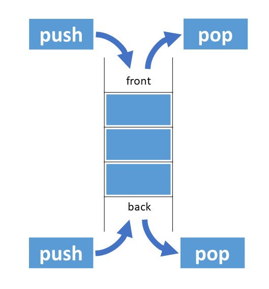

# Stack/Queue

## Stack


__Stack의 특징__
- LIFO(Last In First Out)
- 출입구가 하나인 통로
- push 연산으로 값을 추가하고 pop 연산으로 값을 꺼낼 수 있다.
- 맨 위의 값을 top이라고 부른다.
- Stack에 값이 없을 때 pop 연산 -> Stack Underflow
- Stack이 가득 찼을 때 push 연산 -> __Stack Overflow__

> python의 list 자료구조를 아래와 같이 stack으로 사용할 수 있다.
```
stack = []
for i in range(5):
    stack.append(i) # stack에 0부터 4까지의 값을 push 한다.

for i in range(len(stack)):
    print(stack.pop()) # stack의 값을 꺼낸다.
```

## Queue


__Queue의 특징__
- FIFO(First In First Out)
- 출구와 입구가 다른 통로(터널)
- push 연산으로 front에 값을 추가하고 pop 연산으로 back에서 값을 꺼낼 수 있다.
> python의 list 자료구조를 아래와 같이 queue로 사용할 수 있다.<br>
> 다만, python의 list는 index값을 가지고 모든 값에 접근할 수 있도록 고안된 자료구조이므로,
> Queue로 사용하는 것은 효율성이 좋지 않다.
```
queue = []
for i in range(5):
    queue.append(i) # queue에 0부터 4까지의 값을 push 한다.

for i in range(len(queue)):
    print(queue.pop(0)) # pop 연산에 인덱스 값을 지정해 먼저 넣은 값부터 꺼낸다.
```
## DEQue(Double Ended Queue)


__DEQue의 특징__
- 출입이 가능한 통로가 양쪽으로 있는 통로
- push_front, push_back, pop_front, pop_back 연산이 가능하다.
> python의 기본 라이브러리인 collections의 deque를 임포트라여 사용할 수 있다.
```
from collections import deque
dequeue = deque([2, 3, 4])

dequeue.append(0)
dequeue.appendleft(5)
# dequeue = [5, 2, 3, 4, 0]

print(dequeue.popleft()) # 왼쪽의 값인 5를 꺼낸다.
print(dequeue.pop())     # 오른쪽 값인 0을 꺼낸다.
# dequeue = [2, 3, 4]
```